# **Advance Lane Finding**

## **Objective**

When we drive, the lane markings on the road are our visual references to steer the vehicle. For self-driving car, these lane markings become important visual cues to navigate the road infrastructure. This project describes a image-processing pipeline to detect the lane lines by using Computer Vision techniques through Open Computer Vision Library (OpenCV) in Python. 

## **Results**

  <a href="https://www.youtube.com/watch?v=mryj0pI90V8">
    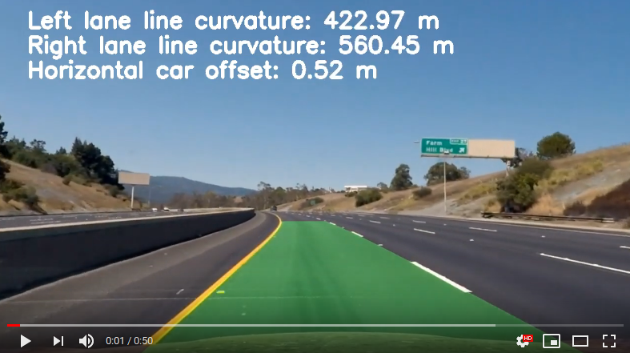
  </a>

## **Pipeline Overview**

* Compute the camera calibration matrix and distortion coefficients given a set of chessboard images.
* Compute the perspective transform matrix for warping.
* Utilize the camera calibration matrix and distortion coefficients to undistort the image.
* Apply gradient and color thresholding to the image to obtain a binary image with activated lane pixels.
* Warp the image to obtain birds-eye view of the image.
* Detect lane pixels and fit polynomial curves to find the lanes boundary.
* Apply moving average filter to the coefficients of the polynomial curve.
* Determine the curvatures of the lanes and vehicle position with respect to center.
* Warp the detected lane boundaries back onto the original image.
* Annotate image with numerical estimation of lanes curvatures and vehicle position.

  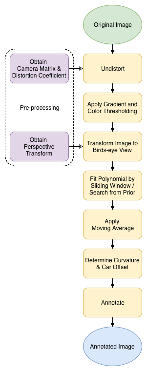

## **Explanation**

**Compute camera calibration using chessboard images**

Every camera produces distorted images due to the nature of the lenses. Such distortion must removed before processing any image.

`cv2.findChessboardCorners` takes multiple images of a chessboard, taken from different angles with the same camera as inputs and returns the corners detected.

`cv2.calibrateCamera` takes the corners detected and the associated dimensions of the chessboard, and returns camera calibration matrix and distortion coefficients. Generally, these coefficients will not change for a given camera (and lens).

The image below depicts the corners drawn onto twenty chessboard images using the `cv2.drawChessboardCorners`.

Note: Some of the chessboard images do not appear because `cv2.findChessboardCorners` is unable to detect the desired number of internal corners of the chessboard.

  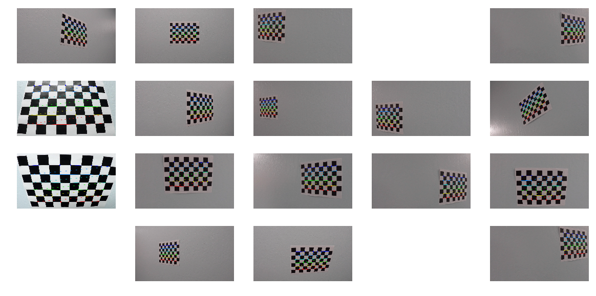

**Obtain perspective transform**

To obtain a birds-eye view of an image to fit curves, perspective transform matrix must be determined.

`cv2.getPerspectiveTransform` takes in source coordinates and destination coordinates, and returns the perspective transform matrix. Souce coordinates and destination coordinates are determined using a test image. The boundaries of source coordinates look like a trapezoid in the original image, and the boundaries of destination coordinates are how that trapezoid looks like from a birds-eye view, which is a rectangle. We also assume that the camera position and orientation will not change across the video. 

The test image below depicts the boundaries of source coordinates and destination coordinates for the warping. 

  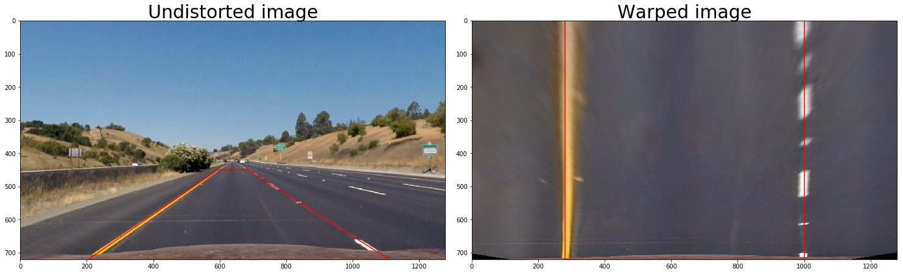

**Apply distortion correction**

The images must be undistorted so lane lines appear as in real world.

`cv2.undistort` takes in the camera calibration matrix and distortion coefficients found during the previous calibration process, and returns undistorted image.

The image below depicts the undistortion process.

  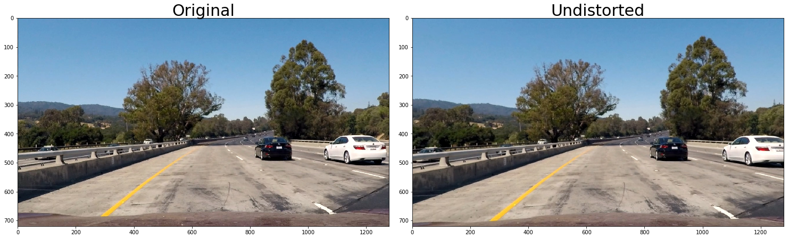

**Apply gradient and color threshold**

To detect lane lines, gradient and color thresholding are applied onto the image. 

Gradient is used to detect lane boundaries as lane boundaries usually have high value of gradient (difference in pixels' intensity). Thresholding is implemented in gradient of x-direction, gradient of y-direction, overall magnitude of gradient and overall direction of gradient.

Color is also used to identify lane lines. The S-channel of the image in HLS format is used for thresholding as this channel works well under different lighting conditions to detect yellow and white markings.

The image below depicts gradient thresholding.

  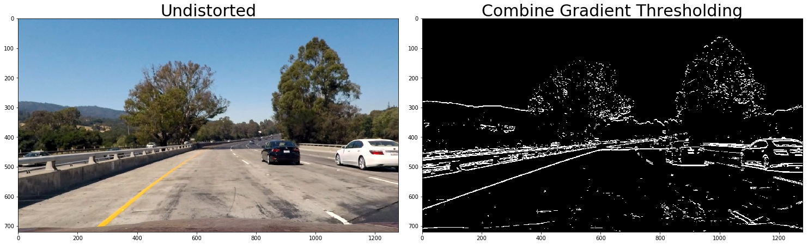

The image below depicts color thresholding.

  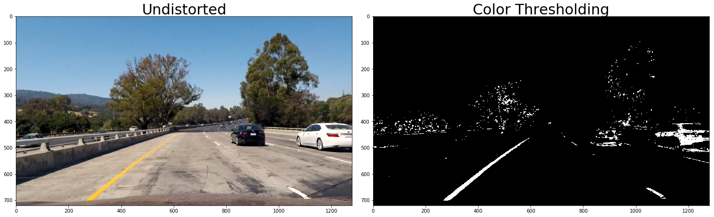

The image below depicts combine effect of gradient and color thresholding.

  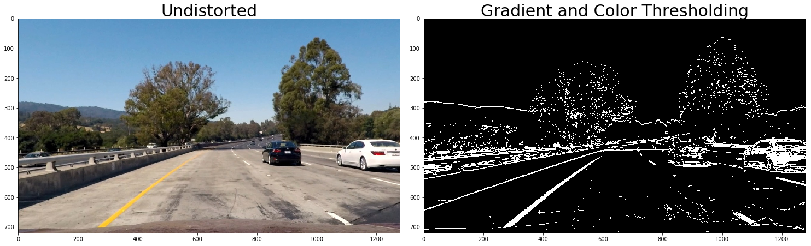

**Apply perspective transform**

Image is warped to obtain birds-eye view. This process allows more accurate polynomial fitting onto the lane lines.

`cv2.warpPerspective` takes in perspective transform matrix obtained earlier and returns warped image.

The image below depicts warping proces.

  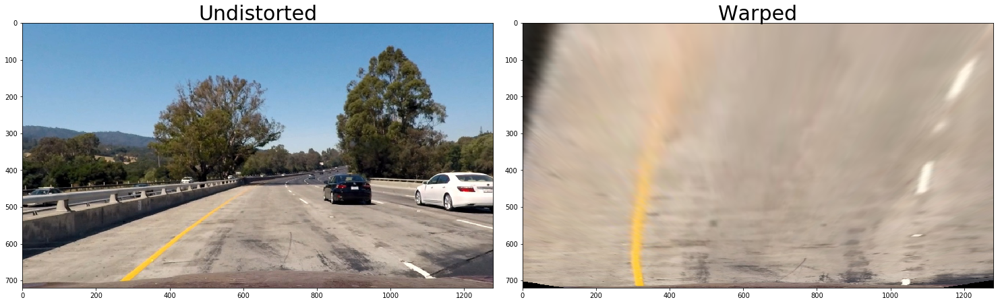

**Fit polynomial**

Second-order polynomial is fitting onto the activated pixels of the warped binary image as detected lane lines.

Firstly, a histogram of activated pixels of the bottom half of the image is computed. This process is done to determine the two bases of the lane lines using the two maxima of the histogram.

Sliding window is initially used to identify lane lines. Each window can only deviate from the previous lower window below a certain threshold. This process can eliminate false positive. Pixels within these windows are fitted with a polynomial curve.

Search from prior is then used to identify subsequent lane lines. Only pixels within a certain threshold of the previous detected lane lines are fitted. This process can speed up detection of lane lines.

Moving average filter is implemented for the coefficients of polynomial curve to smoothen the lanes detection process.  

The image below depicts polynomial fitting using sliding window.

  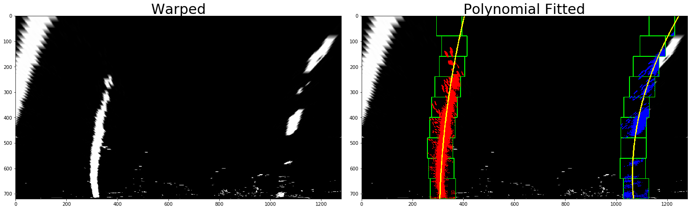

The image below depicts polynomial fitting using search from prior.

  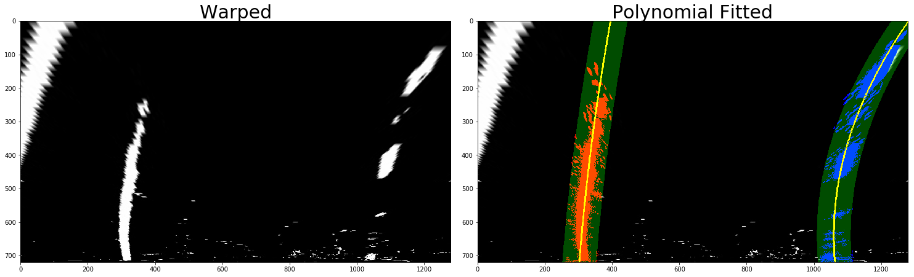

**Annotate curvature and car offset**

Curvature of left and right lanes and the car offset from the center of the lanes are added onto the original image for more information. These metrics are determined using the coefficients of polynomial curves and activated pixels of the warped binary image.

A polygon is generated using the coefficients of the curves to indicate detected lanes. The inverse of perspective transform matrix is used to warp the polygon onto the perspective of the original image.

The image below depicts annotation done.

  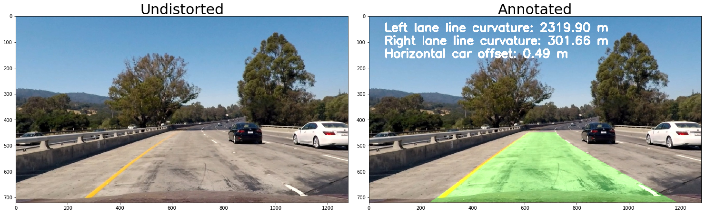

## **Reflections**

**Potential shortcomings**

1. Pipeline does not work well under different lighting conditions.

2. Pipeline does not work well when there is reflection on the wind shield.

3. Pipeline does not work well under tight turns.

**Potential improvements**

1. Consider adding region-of-interest masking.

2. Consider outlier rejections using horizontal distance between lane lines.

3. Consider higher-order polynomial curve fitting for tight corners.

4. Consider better recovery behavior to trigger sliding window polynomial fitting (where there is low number of samples in moving average)
